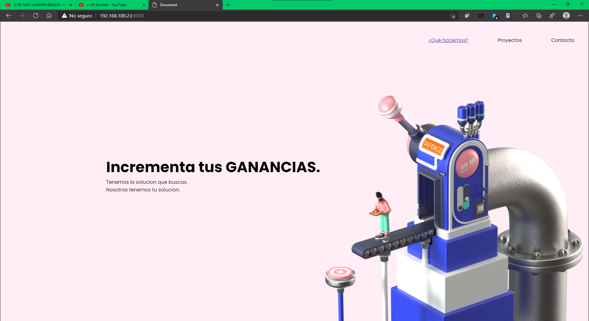

# Este es mi repositorio

## Tabla de contenidos
- [Descripcion](#Descripcion-dos)
- [Tecnologias](#Tecnologias)
- [Autores](#Autores)
## Descripcion dos
Este proyecto es una pagina web muy sencilla.
Esta empresa a la que le estamos ahciendo la pagina es muy profesional y son buenas personas y tiene lindasmascotas

Tecnologias que usamos
-

###### Tecnologias
- Webpack
- Nodejs
- CSS3
- html5
- Mermelada

<ul>
    <li>Hola</li>
</ul>

## Autores
Nombre | Contacto | Emoji
-- | -- | --
Usiel |[github](https://github.com/usielarb) | :tada:
PP | github | :open_mouth:

## Requisitos
- Nodejs
- Navegador

## Usage
Clonar repositorio
```bash
git clone https://qwertyuiop
```

descargamos paquietes de note
```bash
npm install
```
Ejecutamos el servidor de `webpac`
```bash
npm start
```

## Capturas



- [Informacion Importante](./docs/importante.md)
- [Informacion Importante:subtitulo](./docs/importante.md#esto-es-un-subtitulo)
